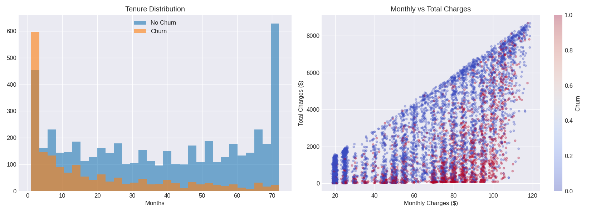
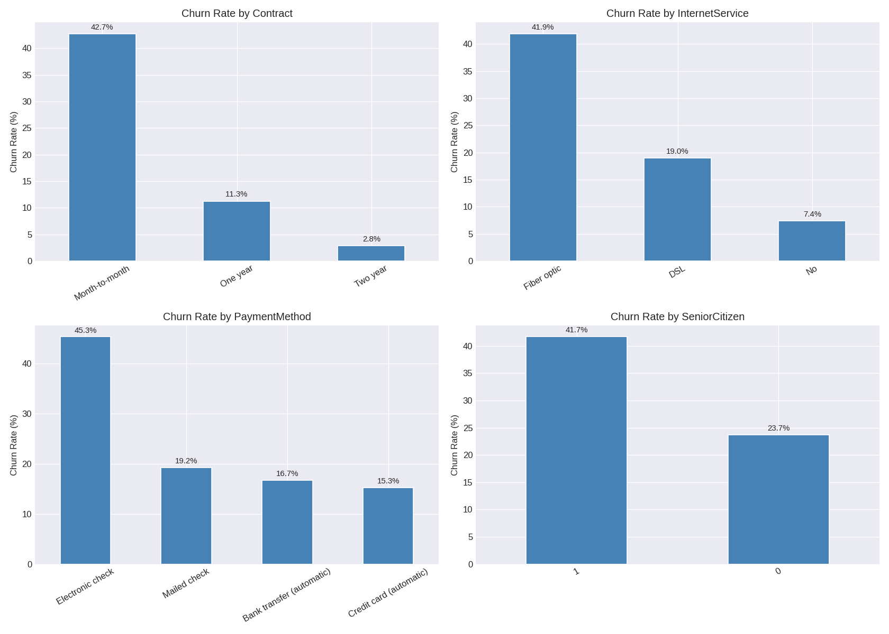
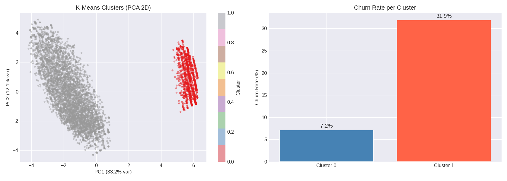
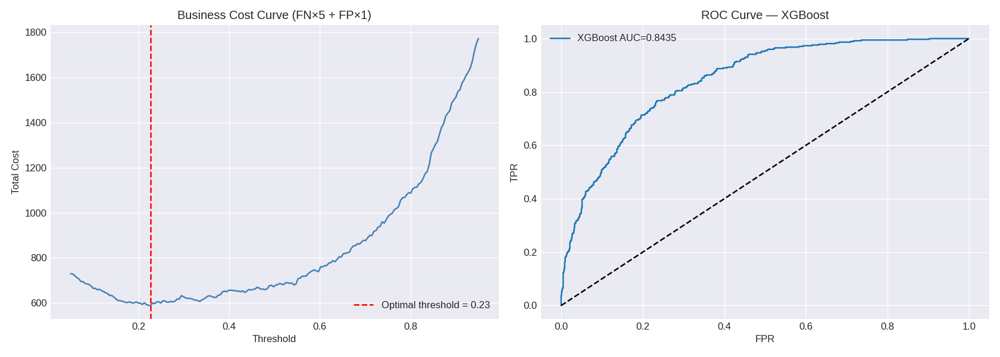
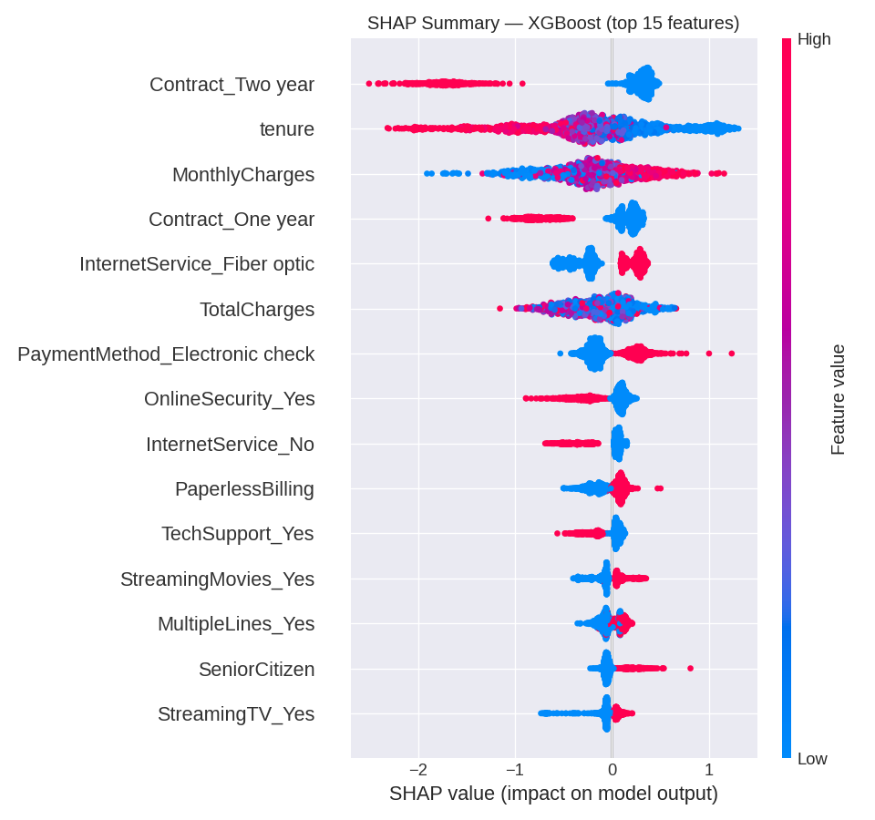
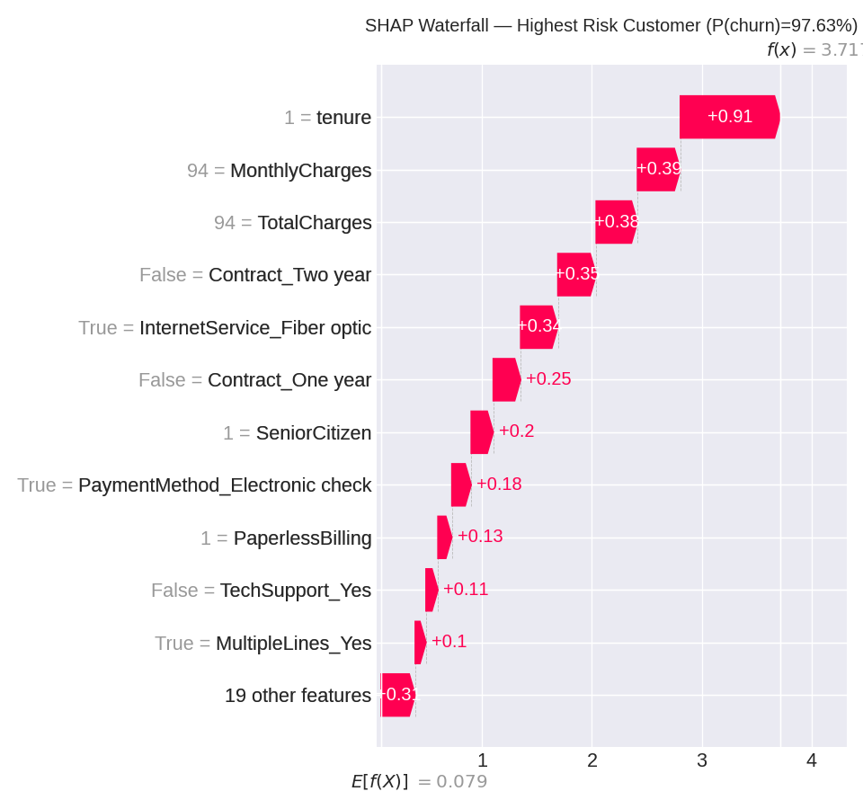

# Customer Churn Prediction

Predicting which telecom customers are likely to cancel their subscription. The project combines unsupervised customer segmentation with supervised classification and business-cost-aware threshold optimization.

---

## Dataset

**IBM Telco Customer Churn** — publicly available, based on real telecom patterns  
Source: [IBM/telco-customer-churn-on-icp4d](https://github.com/IBM/telco-customer-churn-on-icp4d)

| Property | Value |
|---|---|
| Customers | 7,032 (after removing 11 rows with tenure=0) |
| Features | 21 |
| Churn rate | 26.6% (class imbalance) |
| Target | `Churn` — whether the customer left within the last month |

**Feature groups:**

- **Demographics** — gender, senior citizen status, partner, dependents
- **Account info** — tenure (months), contract type, payment method, paperless billing
- **Services** — phone, multiple lines, internet service, online security/backup, device protection, tech support, streaming TV/movies
- **Financials** — monthly charges, total charges

The dataset reflects a realistic business scenario: moderate class imbalance (3:1), correlated financial features (monthly × tenure ≈ total charges), and a strong signal in contract type.

---

## Approach

1. **EDA** — distributions, correlation analysis, churn rate by contract type, internet service, payment method
2. **Customer Segmentation** — K-Means (k=2, selected by silhouette score) reveals two natural groups: basic-plan customers (7.2% churn) vs high-spend customers (31.9% churn)
3. **Modeling** — Logistic Regression baseline → XGBoost / LightGBM comparison
4. **Threshold Tuning** — business-cost optimization assuming FN costs 5× more than FP
5. **SHAP** — global feature importance + local explanation for highest-risk customer

---

## Results

### Model Comparison (default threshold = 0.50)

| Model | Accuracy | Recall | AUC | FN (missed churners) |
|---|---|---|---|---|
| Logistic Regression | 80.1% | 56.4% | 0.8446 | 163 |
| LightGBM | 76.2% | 73.8% | 0.8421 | 98 |
| **XGBoost** | **74.8%** | **78.9%** | **0.8435** | **79** |

### After Threshold Tuning (XGBoost, threshold = 0.23)

| Metric | Default (0.50) | Optimal (0.23) |
|---|---|---|
| Recall | 78.9% | **93.9%** |
| False Negatives | 79 | **23** |
| False Positives | 275 | 474 |
| **Business cost** | **670** | **589 (−12%)** |

### Top SHAP Features (XGBoost)

| Feature | Mean \|SHAP\| | Direction |
|---|---|---|
| Contract_Two year | 0.644 | Reduces churn |
| tenure | 0.529 | Long tenure reduces churn |
| MonthlyCharges | 0.388 | High charges increase churn |
| Contract_One year | 0.297 | Reduces churn |
| InternetService_Fiber optic | 0.285 | Increases churn |
| PaymentMethod_Electronic check | 0.214 | Increases churn |

---

## Visualizations

### EDA — Numeric Features

*Left: churners leave much earlier (avg 18 vs 37.7 months). Right: churn (red) concentrates in high-charge, low-tenure zone.*

### EDA — Churn Rate by Segment

*Month-to-month contracts (42.7%) and fiber optic (41.9%) are the highest-risk segments.*

### Customer Segmentation (K-Means, k=2)

*Two natural clusters: Cluster 0 — basic plan ($21/month, 7.2% churn), Cluster 1 — high-spend ($77/month, 31.9% churn).*

### Threshold Tuning

*Optimal threshold at 0.23 minimizes business cost (FN×5 + FP×1). XGBoost ROC-AUC = 0.8435.*

### SHAP — Global Feature Importance

*Two-year contract and long tenure are the strongest churn reducers. High monthly charges and fiber optic are the strongest risk signals.*

### SHAP — Local Explanation (Highest Risk Customer)

*Customer with P(churn) = 97.63%: tenure = 1 month, $94/month, fiber optic, electronic check, no contract — all top risk factors active simultaneously. Actual outcome: churned.*

---

## Key Takeaways

1. **Contract type is the #1 lever.** Month-to-month customers churn at 42.7% vs 2.8% for two-year contracts. Incentivizing contract upgrades is the most direct intervention.
2. **Fiber optic + high charges = highest-risk segment.** Cluster 1 (78% of customers, avg $77/month) churns at 4.4× the rate of the basic-plan segment.
3. **Early tenure is critical.** Average churner tenure is 18 months vs 37.7 for non-churners. Retention programs should activate in the first 12 months.
4. **Electronic check payment is a churn signal.** 45.3% churn rate — likely overlapping with month-to-month, low-commitment customers. Auto-pay incentives may help.
5. **Threshold matters more than model choice.** All three models have nearly identical AUC (~0.844). Business impact comes from moving the decision threshold, not from model architecture.

